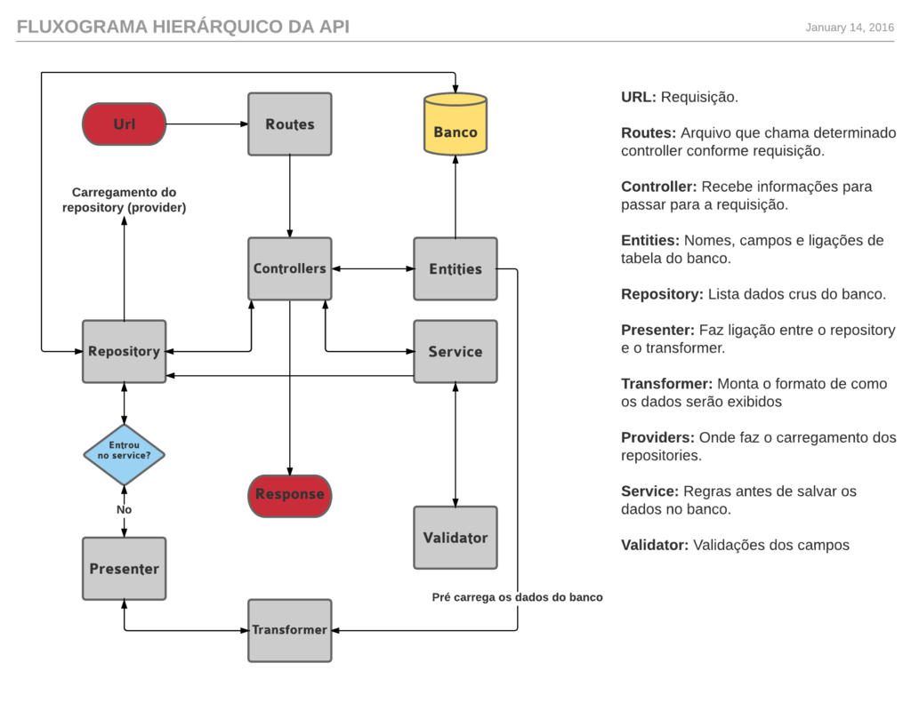

# Laravel5
-----------------------

## Sobre o Projeto
Projeto de um Painel Administrativo e API RestFul para consumo de dados desenvolvido com Laravel Framework 5.

## Tecnologias Usadas
- PHP
- JS
- Jquery
- Json
- CSS (Bootstrap)
- Blade (View)
- SQL (ORM Eloquent)

## Fluxograma Hierarquico

